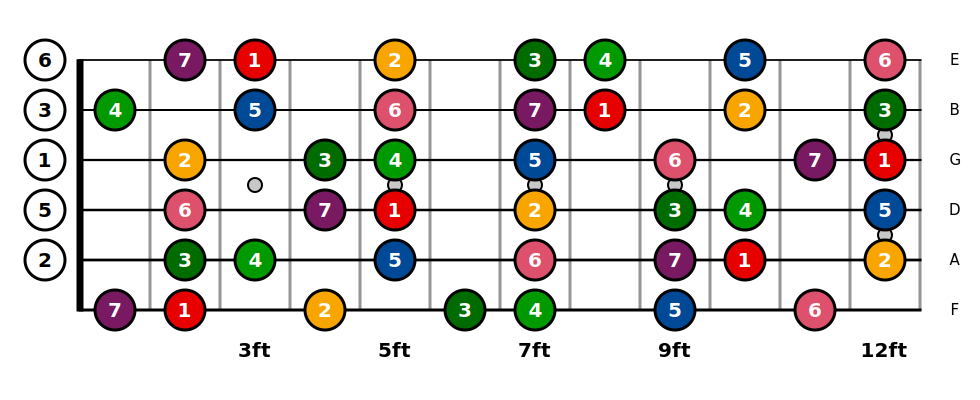
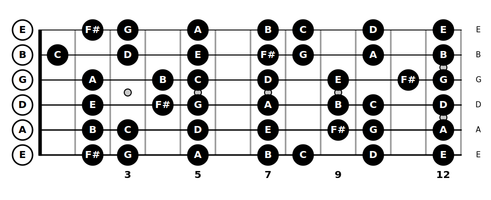
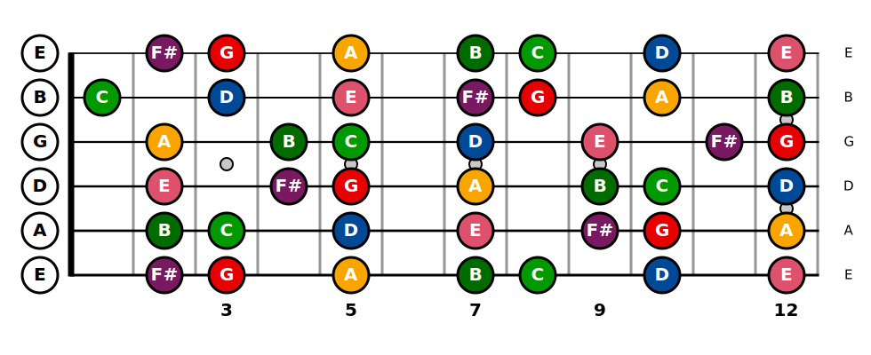
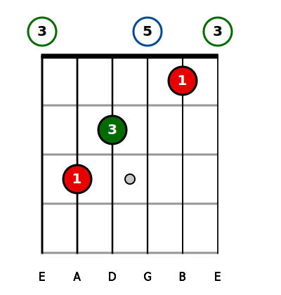

# fretboardgtr
This is a python package to draw fretboard (scales) and guitar chord diagram in svg format based on notes of scales or in finger positions. 

## How to install 
    pip install fretboardgtr

# ScaleGtr

## How to import the class 

    from fretboardgtr import ScaleGtr

## Example of use 

    F=F=ScaleGtr(scale=["G","A","B","C","D","E","F#"],root="G")
    F.customtuning(['F','A','D','G','B','E'])
    F.draw()
    F.save()
    
:warning: The default name of the svg is default.svg. Be careful to not have a file whit this name already existing.

  

The number in the image represents the degree of the scale, 1 is the root so it's G, 2 is the major second so A and so on. 

If you want to show the note name instead :

    F=F=ScaleGtr(scale=["G","A","B","C","D","E","F#"],root="G")
    F.customtuning(['F','A','D','G','B','E'])
    F.theme(show_note_name=True)
    F.draw()
    F.save()
    

  

## Name of the svg 
    F.pathname('Test.svg')
    F.pathname('Test\Test.svg')
    
    
For the second example you have to create a folder whit the name Test before. (Creation of the folder is not yet implemented)
  
## Create the object 

    F=F=ScaleGtr(scale=["G","A","B","C","D","E","F#"],root="G")
If no root precised, C by default. 
If no scale precised, CEG (C major chord) precised.

## Custom tuning
    F.customtuning(['F','A','D','G','B','E'])
    F.customtuning(['D','A','D','G','A','D'])
You can specify an array with all the note in your tunings ( DADGAD, Drop D and so on). The programm automatically calculate positions of the notes. 

## Custom theme 

    F.theme(show_note_name=True,color_scale=False)

  

You can highly customize the fretboard with all the following variables :  
                wf = 50 (width of fret)  
                hf = 70 (height of fret)  
                R = 20  (radius of circle )  
                background_color = 'rgb(255,255,255)'  
                fretcolor = 'rgb(150,150,150)'  
                strings_color = 'rgb(0,0,0)'  
                nut_color = 'rgb(0,0,0)'  
                fretsize = 3  
                string_same_size = False (If False first string bigger than the last)  
                string_size = 3  
                dot_color = 'rgb(200,200,200)'  
                dot_color_stroke = 'rgb(0,0,0)' (small dots on the neck)  
                dot_width_stroke = 2 (small dots on the neck)  
                dot_radius = 7 (small dots on the neck)  
                fontsize_bottom_tuning = 15 (fontsize of the tuning)  
                fontsize_text = 20 (Fontsize of text in circle)  
                open_circle_color = 'rgb(255,255,255)' (for open string)  
                open_circle_stroke_color = 'rgb(0,0,0)' (for open string)  
                open_circle_stroke_width = 3 (for open string)  
                open_text_color = 'rgb(0,0,0)' (for open string)  
                cross_color = 'rgb(0,0,0)' (Cross when doesn't play string )  
                fontsize_cross = 20 (Cross when doesn't play string )  
                fretted_circle_color = 'rgb(0,0,0)' (for fretted string)  
                fretted_circle_stroke_color = 'rgb(0,0,0)' (for fretted string)  
                fretted_circle_stroke_width = 3 (for fretted string)  
                fretted_text_color = 'rgb(255,255,255)' (for fretted string)  
                nut_height = 7  
                show_nut = True  
                first_fret = 0  
                last_fret = 12  
                show_tun = True  
                show_ft = True  
                color_scale = True (for the Scale class)  
                open_color_scale=False (for the Scale class)
                show_note_name = False (if show_not_name==True, show_degree_name is not considered )  
                show_degree_name = True  
                color_chord=True (for the ChordGtr class)  
                open_color_chord=True (for the ChordGtr class)  
               
               
  You can return to the default parameter by pass this argument : default_theme=True and execute. You can also recreate the object. 
  
  ## Custom color
  
    F.set_color(root='yellow')
    F.set_color(minorsecond='rgb(231, 0, 0)')
 
The available variables are the following : 
root, minorsecond, majorsecond, minorthird, majorthird, perfectfourth, diminishedfifth, perfectfifth, minorsixth, majorsixth, minorseventh, majorseventh

You can pass a classic color string ('black','yellow' ..) or a rgb string ('rgb(231, 0, 0)' for example).

You can return to the default parameter by pass this argument : default_theme=True

## draw

    F.draw()
Draw and fill the fretboard.

You can add an optionnal parameter to the draw method `F.draw(fingering([1,2,3,4,5,6))` which draw the fingering like a guitar chord. All the theme parameters are not yet implemented. 

# ChordGtr

## Example of use

    F=ChordGtr(fingering=[0,3,2,0,1,0],root="C")
    F.customtuning(['F','A','D','G','B','E'])
    F.draw()
    F.save()
    
:warning: The default name of the svg is default.svg. Be careful to not have a file whit this name already existing.

  

The use of root is for the color of notes. By default it is set to 'C'. But if no color it has no influence. 

The ChordGtr class has the same set_color(), theme(), save(), draw() methods as ScaleGtr.

## background fill example

    F=ChordGtr(fingering=[0,3,2,0,1,0],root="C")
    F.customtuning(['F','A','D','G','B','E'])
    F.pathname('Test2.svg')
    F.theme(show_note_name=True,background_color='rgb(70,70,70)')
    F.draw()
    F.save()

  

## Todo 
-enharmonics
-list of scales ( Major, Minor, Dorian ..)
