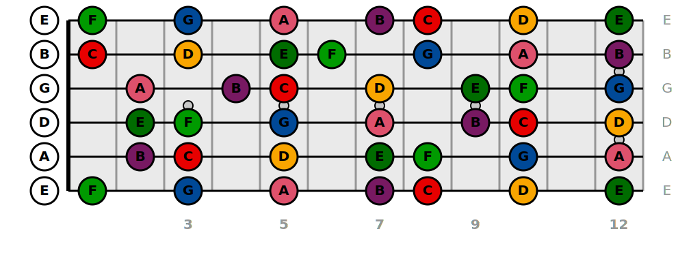

# FretBoardGtr

Package that make easy creation of **highly customizable** fretboards and chords diagrams

<p align="center">
    <a href="https://github.com/antscloud/fretboardgtr/actions"></a>
    <a href="https://fretboardgtr.readthedocs.io/en/latest"></a>
    <a href="https://pypi.org/project/fretboardgtr"></a>
    <a href="https://github.com/antscloud/fretboardgtr"></a>
    <a href="https://codecov.io/gh/antscloud/fretboardgtr"></a>
    <a href="https://www.gnu.org/licenses/agpl-3.0"></a>
    <a href="https://github.com/antscloud/fretboardgtr/issues"></a>
    <a href="https://github.com/antscloud/fretboardgtr/pulls"></a>
</p>

- License: GNU Affero General Public License v3.0
- Documentation: https://fretboardgtr.readthedocs.io/en/latest.

# Get started

To get started simply install the package from PyPI

## How to install

```shell
pip install fretboardgtr
```

## Usage

```python
from fretboardgtr.fretboard import FretBoard
from fretboardgtr.notes_creators import ScaleFromName

fretboard = FretBoard()
c_major = ScaleFromName(root="C", mode="Ionian").get()
fretboard.add_notes(scale=c_major)
fretboard.export("my_fretboard.svg", format="svg")
```



## Documentation

All the documentation can be found in the [documentation](https://fretboardgtr.readthedocs.io/en/latest)
