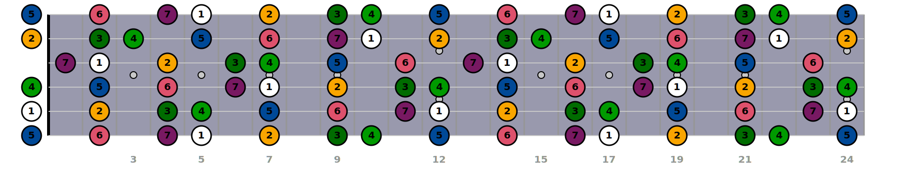
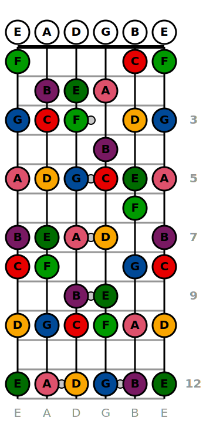
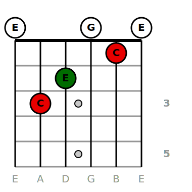

# Get started

To get started simply install the package from PyPI

## How to install

```shell
pip install fretboardgtr
```

## Usage

```python
from fretboardgtr.fretboard import FretBoard
from fretboardgtr.notes_creators import ScaleFromName

fretboard = FretBoard()
c_major = ScaleFromName(root="C", mode="Ionian").get()
fretboard.add_notes(scale=c_major)
fretboard.export("my_fretboard.svg", format="svg")
```


## Customization example

```python
from fretboardgtr.fretboard import FretBoard, FretBoardConfig
from fretboardgtr.notes_creators import ScaleFromName

config = {
    "general": {
        "first_fret": 0,
        "last_fret": 24,
        "show_tuning": False,
        "show_frets": True,
        "show_note_name": False,
        "show_degree_name": True,
        "open_color_scale": True,
        "fretted_color_scale": True,
        "fretted_colors": {
            "root": "rgb(255,255,255)",
        },
        "open_colors": {
            "root": "rgb(255,255,255)",
        },
        "enharmonic": True,
    },
    "background": {"color": "rgb(0,0,50)", "opacity": 0.4},
    "frets": {"color": "rgb(150,150,150)"},
    "fret_numbers": {"color": "rgb(150,150,150)", "fontsize": 20, "fontweight": "bold"},
    "strings": {"color": "rgb(200,200,200)", "width": 2},
}

fretboard_config = FretBoardConfig.from_dict(config)
fretboard = FretBoard(config=fretboard_config)
c_major = ScaleFromName(root="A", mode="Ionian").get()
fretboard.add_notes(scale=c_major)
fretboard.export("my_custom_fretboard.svg", format="svg")
```



Please see the [configuration documentation](./configuration.md) for more details.


## Vertical Fretboard
```python
from fretboardgtr.fretboard import FretBoard
from fretboardgtr.notes_creators import ScaleFromName

fretboard = FretBoard(vertical=True)
c_major = ScaleFromName(root="C", mode="Ionian").get()
fretboard.add_notes(scale=c_major)
fretboard.export("my_vertical_fretboard.svg", format="svg")
```

<p align="center">
  
</p>

## Examples
### Draw a chord diagram

```python
from fretboardgtr.fretboard import FretBoardConfig, FretBoard

config = {
    "general": {
        "first_fret": 0,
        "last_fret": 5,
        "fret_width": 50,
    }
}
fretboard_config = FretBoardConfig.from_dict(config)
fretboard = FretBoard(config=fretboard_config, vertical=True)
c_major = [0, 3, 2, 0, 1, 0]

fretboard.add_fingering(c_major, root="C")
fretboard.export("my_vertical_fretboard.svg", format="svg")
```
<p align="center">
  
</p>

### Draw all propably possible chord position for a specific chord

⚠️ Be careful with this snippets. This example generate over 1000 svgs
```python
    TUNING = ["E", "A", "D", "G", "B", "E"]
    CHORD_ROOT = "C"
    CHORD_QUALITY = "M"

    fingerings = (
        ChordFromName(root=CHORD_ROOT, quality=CHORD_QUALITY)
        .get()
        .get_probablely_possible_fingering(TUNING)
    )
    for i, fingering in enumerate(fingerings):
        _cleaned_fingering = [pos for pos in fingering if pos is not None and pos != 0]
        first_fret = min(_cleaned_fingering) - 2
        if first_fret < 0:
            first_fret = 0

        last_fret = max(_cleaned_fingering) + 2
        if last_fret < 4:
            last_fret = 4

        config = {
            "general": {
                "first_fret": first_fret,
                "last_fret": last_fret,
                "fret_width": 50,
            }
        }
        fretboard_config = FretBoardConfig.from_dict(config)
        fretboard = FretBoard(config=fretboard_config, tuning=TUNING, vertical=True)
        fretboard.add_fingering(fingering, root=CHORD_ROOT)
        fretboard.export(f"./C_Major/C_Major_position_{i}.svg", format="svg")
```
